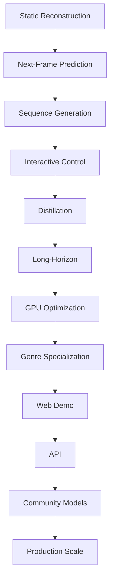

# Functional Milestones - Capability-Based Progress

## Core Philosophy
Each milestone represents a **demonstrable capability** that unlocks the next level of functionality. Time is irrelevant - only working features matter.

---

## 🏗️ Foundation Milestones

### Milestone 1: Static World Reconstruction
**Capability Unlocked:** Can encode and decode game frames

**Demonstrable:**
- Input: Any 256x256 game screenshot
- Output: Reconstructed image with PSNR > 30dB
- Live demo: Upload image → See reconstruction
- Latent space visualization showing meaningful clusters

**Success Criteria:**
```python
def validate_reconstruction():
    return {
        'visual_quality': psnr > 30 and ssim > 0.85,
        'compression': latent_size < original_size / 10,
        'speed': encode_decode_time < 100ms,
        'memory': vram_usage < 4GB
    }
```

**Unlocks Next:** Temporal modeling capability

---

### Milestone 2: Next-Frame Prediction
**Capability Unlocked:** Can predict what happens next

**Demonstrable:**
- Input: 3 consecutive frames
- Output: Predicted 4th frame
- Live demo: Show ground truth vs prediction side-by-side
- Error visualization heatmap

**Success Criteria:**
```python
def validate_prediction():
    return {
        'accuracy': frame_mse < 0.01,
        'physics': object_trajectories_correct > 80%,
        'stability': no_artifacts_for_10_predictions,
        'diversity': generates_different_futures
    }
```

**Unlocks Next:** Multi-step generation

---

### Milestone 3: Short Sequence Generation
**Capability Unlocked:** Can generate 1-second coherent clips

**Demonstrable:**
- Input: Single frame
- Output: 30-frame sequence (1 second at 30fps)
- Live demo: Multiple sequences from same start
- Side-by-side with real gameplay

**Success Criteria:**
```python
def validate_short_generation():
    return {
        'coherence': no_flickering_or_jumps,
        'consistency': objects_persist_correctly,
        'physics': gravity_and_collisions_work,
        'diversity': different_sequences_each_time
    }
```

**Unlocks Next:** Interactive control

---

## 🎮 Interaction Milestones

### Milestone 4: Action-Responsive Generation
**Capability Unlocked:** Responds to user input

**Demonstrable:**
- Input: Frame + arrow key press
- Output: Character moves in that direction
- Live demo: WASD control in browser
- Show action → effect mapping

**Success Criteria:**
```python
def validate_control():
    return {
        'responsiveness': action_accuracy > 95%,
        'latency': response_time < 50ms,
        'consistency': same_action_same_result,
        'coverage': all_5_actions_work  # up,down,left,right,jump
    }
```

**Unlocks Next:** Knowledge distillation

---

### Milestone 5: Teacher-Student Learning
**Capability Unlocked:** Can learn from larger models

**Demonstrable:**
- Input: GameCraft generation
- Output: Our model matching it at 60% quality
- Live demo: Teacher vs Student comparison
- Quality metrics dashboard

**Success Criteria:**
```python
def validate_distillation():
    return {
        'quality_retention': similarity > 0.6,
        'size_reduction': params_reduced_by_40x,
        'speed_improvement': inference_10x_faster,
        'feature_preservation': key_behaviors_maintained
    }
```

**Unlocks Next:** Extended generation

---

## 🚀 Advanced Milestones

### Milestone 6: Long-Horizon Generation
**Capability Unlocked:** Can maintain coherence for 30+ seconds

**Demonstrable:**
- Input: Initial frame or text prompt
- Output: 900+ frame sequence (30 seconds)
- Live demo: Real-time generation with progress bar
- Memory consistency visualization

**Success Criteria:**
```python
def validate_long_generation():
    return {
        'temporal_consistency': no_drift_for_30_seconds,
        'memory': remembers_visited_locations,
        'object_permanence': items_stay_where_placed,
        'narrative_coherence': follows_logical_progression
    }
```

**Unlocks Next:** Real-time performance

---

### Milestone 7: Consumer GPU Performance
**Capability Unlocked:** Runs on RTX 3060

**Demonstrable:**
- Live benchmark on different GPUs
- FPS counter in real-time
- VRAM usage monitor
- Settings slider (quality vs speed)

**Success Criteria:**
```python
def validate_performance():
    gpu_benchmarks = {
        'RTX_4090': fps >= 30,
        'RTX_4080': fps >= 25,
        'RTX_3070': fps >= 15,
        'RTX_3060': fps >= 8,  # Critical threshold
        'VRAM_usage': memory <= 8GB,
        'CPU_usage': cpu_percent < 50
    }
```

**Unlocks Next:** Domain specialization

---

### Milestone 8: Genre-Specific Excellence
**Capability Unlocked:** Specialized models for different game types

**Demonstrable:**
- Platformer model: Accurate physics, smooth jumping
- Puzzle model: Logical state transitions
- RPG model: Inventory and stats persistence
- Comparative demo showing each specialty

**Success Criteria:**
```python
def validate_specialization():
    return {
        'platformer': physics_accuracy > 90%,
        'puzzle': logic_consistency > 95%,
        'rpg': state_management_correct,
        'quality_gain': specialized_20%_better_than_general
    }
```

**Unlocks Next:** Production deployment

---

## 🌍 Deployment Milestones

### Milestone 9: Web-Playable Demo
**Capability Unlocked:** Anyone can try it instantly

**Demonstrable:**
- Public URL with no installation
- Mobile responsive
- Social sharing features
- Analytics dashboard

**Success Criteria:**
```python
def validate_web_demo():
    return {
        'accessibility': works_on_all_browsers,
        'performance': smooth_on_average_hardware,
        'stability': <1%_crash_rate,
        'engagement': avg_session > 5_minutes
    }
```

**Unlocks Next:** API access

---

### Milestone 10: Developer-Ready API
**Capability Unlocked:** Others can build with it

**Demonstrable:**
- REST/WebSocket endpoints
- Python/JS client libraries
- Interactive API documentation
- Code examples gallery

**Success Criteria:**
```python
def validate_api():
    return {
        'latency': p95 < 100ms,
        'throughput': 1000_requests_per_second,
        'reliability': 99.9%_uptime,
        'adoption': 100+_api_keys_issued
    }
```

**Unlocks Next:** Community models

---

## 🎯 Community Milestones

### Milestone 11: First Community Fine-Tune
**Capability Unlocked:** Others can customize the model

**Demonstrable:**
- Someone else's fine-tuned model
- Training guide that works
- Model zoo with variants
- Comparison of community models

**Success Criteria:**
```python
def validate_community():
    return {
        'reproducibility': others_can_train,
        'quality': community_model_works_well,
        'documentation': step_by_step_guide_complete,
        'engagement': 10+_community_models
    }
```

**Unlocks Next:** Ecosystem growth

---

### Milestone 12: Production Scale
**Capability Unlocked:** Handles real-world load

**Demonstrable:**
- 1000+ concurrent users
- Geographic distribution
- Auto-scaling in action
- Cost per user metrics

**Success Criteria:**
```python
def validate_scale():
    return {
        'concurrent_users': 1000+,
        'global_latency': p95 < 200ms_worldwide,
        'cost_efficiency': <$0.01_per_user_hour,
        'stability': zero_downtime_deployment
    }
```

---

## 🏆 Success Milestones (Non-Technical)

### Adoption Milestone: Critical Mass
**Capability Unlocked:** Self-sustaining community

**Demonstrable:**
- GitHub trending
- YouTube tutorials by others
- Discord active 24/7
- Memes being made

**Success Criteria:**
- 5,000+ GitHub stars
- 1,000+ daily active users
- 50+ community contributors
- 10+ derivative projects

---

### Impact Milestone: Democratization Achieved
**Capability Unlocked:** Changed the landscape

**Demonstrable:**
- Indie devs using it in games
- Students learning with it
- Researchers building on it
- Companies adopting it

**Success Criteria:**
- Used in 10+ shipped games
- 100+ research citations
- 5+ commercial adoptions
- Teaching material at universities

---

## 📊 Progress Tracking

### Capability Matrix
```python
capabilities = {
    # Core Capabilities
    'static_reconstruction': False,
    'temporal_prediction': False,
    'sequence_generation': False,
    'interactive_control': False,
    
    # Advanced Capabilities
    'distillation_complete': False,
    'long_horizon_stable': False,
    'consumer_gpu_ready': False,
    'genre_specialized': False,
    
    # Deployment Capabilities
    'web_playable': False,
    'api_available': False,
    'community_enabled': False,
    'production_scale': False
}

def overall_progress():
    return sum(capabilities.values()) / len(capabilities) * 100
```

---

## 🔄 Milestone Dependencies



---

## 🎬 Demo-First Development

Each milestone MUST have a demo that:
1. **Works in browser** (no installation)
2. **Shows clear before/after** (or with/without)
3. **Includes metrics** (FPS, quality scores)
4. **Is shareable** (unique URL)
5. **Tells a story** (why this matters)

---

## 🚦 Go/No-Go Gates (Functionality-Based)

### Gate 1: Core Technology
```python
if can_reconstruct and can_predict_next_frame:
    continue_to_generation()
else:
    fundamental_research_needed()
```

### Gate 2: Interactivity
```python
if responds_to_all_actions and latency < 100ms:
    proceed_to_distillation()
else:
    fix_control_system()
```

### Gate 3: Quality
```python
if distillation_quality > 0.5 and long_horizon_stable:
    move_to_optimization()
else:
    try_alternative_approach()
```

### Gate 4: Performance
```python
if runs_on_rtx_3060 and fps >= 8:
    ready_for_release()
else:
    emergency_optimization()
```

---

## 📈 Success Metrics (Not Time-Based)

### Technical Success
- ✅ Each capability works as specified
- ✅ All demos are public and functional
- ✅ Performance meets consumer GPU targets

### Community Success
- ✅ Others can reproduce results
- ✅ Community creates new models
- ✅ Ecosystem starts forming

### Impact Success
- ✅ Enables new applications
- ✅ Lowers barrier to entry
- ✅ Inspires others to build

---

## 🎯 The One Test That Matters

```python
def ultimate_test():
    """
    Can a teenager with an RTX 3060 
    generate an interactive game world
    in their bedroom?
    """
    return (
        model_size < 2GB and
        vram_requirement <= 8GB and
        fps >= 8 and
        quality >= "good_enough" and
        setup_time < 10_minutes
    )
```

If this test passes, we've succeeded in democratizing world models.

---

## 🔥 Demonstration Cascade

Each milestone enables a more impressive demo:

1. **Static**: "Look, it can compress game images!"
2. **Prediction**: "It understands what happens next!"
3. **Generation**: "It creates new game footage!"
4. **Interactive**: "You can control it!"
5. **Distilled**: "It's tiny but smart!"
6. **Long**: "It remembers everything!"
7. **Fast**: "It runs on YOUR computer!"
8. **Specialized**: "It mastered different genres!"
9. **Web**: "Try it right now!"
10. **API**: "Build with it!"
11. **Community**: "Everyone's making cool stuff!"
12. **Scale**: "It's ready for millions!"

---

*Remember: Features ship when they work, not when the calendar says so.*