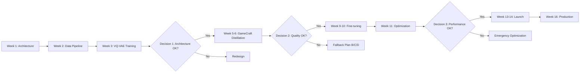

# 🚀 Lightweight World Model - Project Roadmap

## Executive Summary
**Mission:** Democratize world model technology by creating a 100x smaller alternative to Genie 3 that runs on consumer GPUs

**Vision:** Enable every developer to generate interactive game worlds in real-time for <$0.01/minute

**Timeline:** 16 weeks | **Budget:** $1,500 | **Team:** 1-3 people

---

## 📊 High-Level Timeline

```
Week 1-4:   [████████] Foundation & Proof of Concept
Week 5-8:   [████████] Knowledge Distillation  
Week 9-12:  [████████] Optimization & Demo
Week 13-16: [████████] Production & Launch
```

---

## 🎯 Critical Path



---

## 📈 Key Performance Indicators

### Technical KPIs
| Metric | Target | Stretch Goal |
|--------|--------|--------------|
| Model Size | 350M params | 150M params |
| VRAM Usage | <8GB | <4GB |
| FPS (RTX 4090) | 30 | 60 |
| FPS (RTX 3060) | 8 | 15 |
| Generation Length | 30 seconds | 2 minutes |
| Quality vs Teacher | 70% | 85% |

### Community KPIs
| Metric | Target | Stretch Goal |
|--------|--------|--------------|
| GitHub Stars | 5,000 | 20,000 |
| Model Downloads | 10,000 | 100,000 |
| Active Users | 1,000 | 10,000 |
| Community Fine-tunes | 50 | 500 |
| Contributors | 20 | 100 |

### Business KPIs
| Metric | Target | Stretch Goal |
|--------|--------|--------------|
| Total Cost | <$1,500 | <$1,000 |
| Time to Market | 16 weeks | 12 weeks |
| Inference Cost | <$0.01/min | <$0.001/min |
| User Satisfaction | 80% | 95% |

---

## 🛠️ Development Phases

### Phase 1: Foundation (Month 1)
**Goal:** Prove technical feasibility

```python
deliverables = {
    'week_1': 'Architecture implementation',
    'week_2': 'Data collection pipeline',  
    'week_3': 'VQ-VAE reconstruction working',
    'week_4': 'Dynamics model prototype'
}
```

**Success Metrics:**
- ✅ PSNR > 30dB reconstruction
- ✅ <8GB VRAM usage
- ✅ 100+ hours data collected

### Phase 2: Distillation (Month 2)
**Goal:** Achieve 70% of teacher quality at 40x compression

```python
deliverables = {
    'week_5': 'GameCraft teacher setup',
    'week_6': 'Encoder distillation',
    'week_7': 'Dynamics distillation',
    'week_8': 'Full model distillation'
}
```

**Success Metrics:**
- ✅ Student-teacher similarity > 0.7
- ✅ FVD < 150
- ✅ 30-second coherent generation

### Phase 3: Optimization (Month 3)
**Goal:** Production-ready performance

```python
deliverables = {
    'week_9-10': 'Domain fine-tuning',
    'week_11': 'TensorRT/quantization',
    'week_12': 'Web demo deployment'
}
```

**Success Metrics:**
- ✅ 30 FPS on RTX 4090
- ✅ 8 FPS on RTX 3060
- ✅ <100ms latency

### Phase 4: Launch (Month 4)
**Goal:** Community adoption

```python
deliverables = {
    'week_13-14': 'Open source release',
    'week_15': 'Documentation & tutorials',
    'week_16': 'Production deployment'
}
```

**Success Metrics:**
- ✅ 1,000+ GitHub stars
- ✅ 100+ users in first week
- ✅ 10+ community contributions

---

## 💰 Budget Breakdown

```
GPU Compute (AWS/Lambda Labs)
├── Distillation: $500-700
├── Fine-tuning: $300-400
└── Experiments: $200-300

Infrastructure
├── Storage (1TB): $100
├── CDN/Hosting: $100
└── Monitoring: $50

Contingency (20%): $250

TOTAL: $1,500
```

---

## 🚨 Risk Matrix

| Risk | Probability | Impact | Mitigation |
|------|------------|--------|------------|
| Distillation fails | Low | High | Multiple fallback plans (B/C/D) |
| Over budget | Medium | Medium | Start with Tiny model |
| Poor performance | Low | High | Progressive optimization |
| Low adoption | Medium | Medium | Strong marketing plan |
| Technical debt | Low | Low | Clean architecture from start |

---

## 🎮 Demo Progression

### Week 4: First Demo
- Static frame reconstruction
- Basic next-frame prediction
- Command-line interface

### Week 8: Alpha Demo
- 10-second generation
- Basic web interface
- Action controls working

### Week 12: Beta Demo
- 30-second generation
- Full web interface
- Real-time interaction
- Multiple game styles

### Week 16: Launch Demo
- Minute+ generation
- Polished UI/UX
- Multi-user support
- API access

---

## 📢 Marketing Timeline

### Pre-Launch (Weeks 1-12)
- [ ] Week 4: First technical blog post
- [ ] Week 8: Demo video on Twitter
- [ ] Week 10: Reddit r/MachineLearning post
- [ ] Week 12: YouTube tutorial

### Launch Week (Week 13)
- [ ] Monday: GitHub release
- [ ] Tuesday: HackerNews submission
- [ ] Wednesday: Product Hunt launch
- [ ] Thursday: Discord server opening
- [ ] Friday: Press release

### Post-Launch (Weeks 14-16)
- [ ] Community showcases
- [ ] Developer tutorials
- [ ] Partnership announcements
- [ ] Roadmap for v2

---

## 🏆 Success Scenarios

### Minimum Success (Achieved all MUST haves)
- Model works at 5+ FPS on RTX 3060
- 100+ users actively using
- Basic documentation complete
- $1,500 budget maintained

### Target Success (Our goal)
- 15+ FPS on RTX 3060
- 1,000+ active users
- Community contributing
- Press coverage achieved
- Under budget

### Exceptional Success (Dream scenario)
- 30+ FPS on RTX 3060
- 10,000+ active users
- Major partnership secured
- Viral adoption
- Follow-on funding secured

---

## 📝 Weekly Checklist

### Every Monday
- [ ] Review milestone progress
- [ ] Update GitHub project board
- [ ] Check budget burn rate
- [ ] Team sync meeting

### Every Friday
- [ ] Push code updates
- [ ] Update documentation
- [ ] Community update post
- [ ] Metrics dashboard review

### Every Milestone
- [ ] Demo video/GIF
- [ ] Blog post
- [ ] Social media announcement
- [ ] Stakeholder update

---

## 🔄 Iteration Cycles

```
Week 1-4:   Build → Test → Validate
Week 5-8:   Distill → Evaluate → Refine
Week 9-12:  Optimize → Benchmark → Polish  
Week 13-16: Release → Gather Feedback → Iterate
```

---

## 🎯 North Star Metrics

The project succeeds if we achieve:

1. **Technical Victory:** 70% of Genie 3 quality at 1% of the size
2. **Community Victory:** 1,000+ developers using our model
3. **Impact Victory:** Democratized access to world model technology

---

## 📅 Launch Countdown

```python
def days_until_launch():
    milestones = {
        'Architecture Complete': -105,  # Day 7
        'First Training Run': -91,      # Day 21
        'Distillation Start': -77,      # Day 35
        'Alpha Release': -56,           # Day 56
        'Beta Release': -28,            # Day 84
        'LAUNCH DAY': 0,                # Day 112
    }
    return milestones
```

---

## 🚀 Post-Launch Roadmap

### Month 5-6: Expansion
- Mobile/edge deployment
- Browser-based inference
- Game engine plugins

### Month 7-9: Enhancement
- 3D world generation
- Multi-modal control (text + sketch)
- Style transfer capabilities

### Month 10-12: Platform
- Cloud API service
- Enterprise features
- Training-as-a-service

### Year 2: Next Generation
- 1B parameter "Pro" model
- Real-time multiplayer
- VR/AR integration
- Commercial licensing

---

## 📚 Resources & Links

**Repositories:**
- Main: github.com/annasba07/lightweight-world-model
- Models: huggingface.co/lightweight-world-model
- Datasets: TBD

**Community:**
- Discord: TBD
- Twitter: @LightweightWM
- Reddit: r/worldmodels

**Documentation:**
- Docs: docs.lightweight-wm.ai
- API: api.lightweight-wm.ai
- Papers: arxiv.org/lightweight-world-model

---

## ✅ Pre-Launch Checklist

### Technical
- [ ] All tests passing
- [ ] Documentation complete
- [ ] Docker images built
- [ ] CI/CD pipeline ready
- [ ] Monitoring setup

### Community
- [ ] Discord server ready
- [ ] FAQ prepared
- [ ] Tutorials recorded
- [ ] Example notebooks
- [ ] Contribution guidelines

### Marketing
- [ ] Landing page live
- [ ] Demo video ready
- [ ] Press kit prepared
- [ ] Launch posts drafted
- [ ] Influencers contacted

### Legal
- [ ] License chosen (MIT)
- [ ] Code of conduct
- [ ] Privacy policy
- [ ] Terms of service
- [ ] Model card complete

---

## 💭 Final Thoughts

This project represents a critical step in democratizing AI world models. By making this technology accessible to individual developers and small teams, we're enabling a new wave of creative applications that were previously impossible.

**Remember:** We're not trying to beat Genie 3 on quality - we're trying to beat it on accessibility. If a teenager with a gaming laptop can generate interactive worlds, we've won.

---

*"The best way to predict the future is to invent it."* - Alan Kay

Let's build the future of interactive AI, one frame at a time. 🌍✨